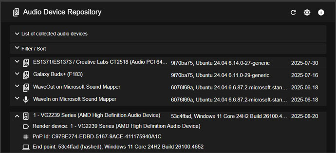

# Audio Device Repository Client

Visualizes an audio devices repository using Next.js / React / TypeScript.<br>
Launch it here [here](https://list-audio-react-app.vercel.app).<br>
The *Audio Device Repository Client* is primary client of the *Device Repository Server*,
see [audio-device-repo-server](https://github.com/collect-sound-devices/audio-device-repo-server/).<br>



## Web Hosting

### Client
- The *Audio Device Repository Client* is deployed on Vercel at https://list-audio-react-app.vercel.app.

### Server
- The *Device Repository Server* is hosted on GitHub Codespaces.<br>
  It starts automatically (on-demand).

## Development Environment

### (Optional) Compile and start the server locally

- Check out the backend repo [audio-device-repo-server](https://github.com/eduarddanziger/audio-device-repo-server/) and install .NET tools
- Start the ASP.NET Core Web API Server:

```powershell
cd DeviceRepoAspNetCore
dotnet run --launch-profile http
```

### Start the client locally (development mode)

1. Install dependencies:
```bash
npm install
```

*Note*<br>
*- If you use locally hosted *Device Repository Server*, configure environment variables so the client points to your local backend.
You can edit `.env.development` file or set the environment variables directly via powershell `$env:NEXT_PUBLIC_API_GITHUB_URL = "http://localhost:5027/api"`
or via cmd.exe `setx NEXT_PUBLIC_API_GITHUB_URL "http://localhost:5027/api"`.*

2. Start the npm development server:
```bash
npm run dev
```

3. Open a browser at http://localhost:3000.

*Notes*<br>
*- The app also supports Azure as a target by setting `NEXT_PUBLIC_API_HOSTED_ON=AZURE` and providing `NEXT_PUBLIC_API_AZURE_URL`, see `.env.development` file*<br>
*- The values can be plain URLs or secure pre-defined encrypted strings (the app will attempt to decrypt and fall back to plaintext if decryption fails)*.

## Local deployment (production mode)

*Note*<br>
*- If you use locally hosted *Device Repository Server*, configure environment variables so the client points to your local backend.
You can edit `.env.production` file or set the environment variable(s) directly NEXT_PUBLIC_API_GITHUB_URL, see 

1. Build the client for production:

```bash
npm run build
```

2. Start the npm production server:

```bash
npm start
```

3. Open a browser at http://localhost:3000.

## Changelog
- 2026.01 Device removal added 
- 2025.12 Fetching code moved to the Next.js Server Components (RCS)
- 2025.12 Migrated from a Vite-based SPA to Next.js (App Router).

