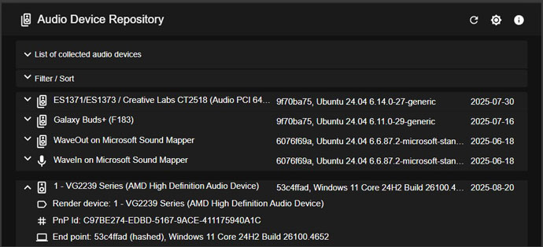
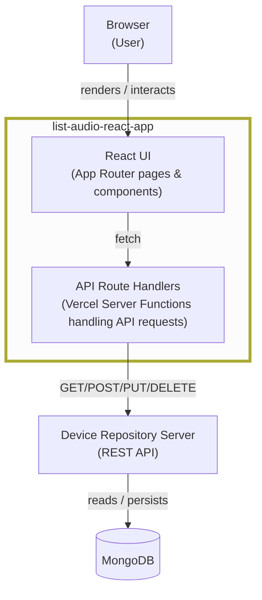

# list-audio-react-app (Audio Device Repository Client)

*Audio Device Repository Client* is a Next.js / React / TypeScript web client, providing a simple,
responsive UI for the *Device Repository Server*.<br>
Launch it [here](https://list-audio-react-app.vercel.app).<br>
It is the primary client of the *Device Repository Server*,
see [audio-device-repo-server](https://github.com/collect-sound-devices/audio-device-repo-server/).<br>



## Architecture

<div style="zoom: 0.5;">


```mermaid
flowchart TD

classDef stressedBox fill:#f0f0f0,fill-opacity:0.2,stroke-width:4px;

browser["Browser<br>(User)"]

subgraph clientApp["list-audio-react-app<br>(Next.js, deployed on Vercel)"]
    reactUi["React UI<br>(App Router pages & components)"]
    apiRoutes["API Route Handlers<br>(Vercel Server Functions handling API requests)"]
end
class clientApp stressedBox

repoServer["Device Repository Server<br>(REST API)"]
mongoDb[("MongoDB")]

browser -->|renders / interacts| reactUi
reactUi -->|fetch| apiRoutes
apiRoutes -->|GET/POST/PUT/DELETE| repoServer
repoServer -->|reads / persists| mongoDb

```
</div>

## Functions

- Browsing: shows the current list of collected audio devices and
  expands a row to display device type, PnP ID, input/output volume etc.
- Filtering and sorting: searches by query string and sorts by device name,
  host name, operating system, or last update.
- Maintenance: refreshes a single device from the backend and
  deletes a device after confirmation.
- Runtime information: shows frontend version and backend version/runtime on
  the `About` page.
- Backend on demand: starts the GitHub Codespaces-hosted backend
and retries while it becomes available.

## Technologies Used

- React 19 / TypeScript.
- Next.js 16 with Route Handlers, deployed as Vercel Server Functions to handle API requests.
- MUI (Material UI) v7, incl. `@mui/material-nextjs` for the App Router cache provider.
- i18next / react-i18next for localization.
- ESLint (`eslint-config-next`) for linting.
- Vercel for hosting, with GitHub Actions for CI/CD.
- Qodana for static analysis.

## Used design patterns

- Backend-for-Frontend: `app/api/**/route.ts` proxy the browser to the *Device Repository Server*.
- Adapter/Mapper: `types/AudioDevice.ts` `AudioDevice.fromApiData()` maps the REST DTO to the client model.
- Service Layer: `services/AudioDeviceFetchService.ts` encapsulates fetching and retry logic.
- Provider: `app/Providers.tsx` and `contexts/ThemeContext.tsx` supply theme, i18n and MUI context to the app.

## Web Hosting (Primary Use Case)

### Client
- The *Audio Device Repository Client* is deployed on Vercel at https://list-audio-react-app.vercel.app.
- GitHub Actions uses `.github/workflows/vercel-init.yml` for one-time Vercel project setup and `.github/workflows/deploy.yml` for regular production deployments.

### Server
- The *Device Repository Server* is hosted on GitHub Codespaces.<br>
  It starts automatically (on-demand).

## Build and Debug

### Prerequisites

- Node.js (LTS) and npm.
- Backend target configuration (`.env.development` / `.env.production`):
  - By default the client targets the GitHub Codespaces-hosted server via `NEXT_PUBLIC_API_GITHUB_URL`.
    Point it to a locally hosted server instead, e.g. via PowerShell `$env:NEXT_PUBLIC_API_GITHUB_URL = "http://localhost:5027/api"`
    or via cmd.exe `setx NEXT_PUBLIC_API_GITHUB_URL "http://localhost:5027/api"`.
  - To target Azure instead, set `NEXT_PUBLIC_API_HOSTED_ON=AZURE` and `NEXT_PUBLIC_API_AZURE_URL`.
  - To let the app start the GitHub Codespace on demand, set `GITHUB_PAT` as a server-side environment variable.

### (Optional) Compile and start the server locally

- Check out the backend repo [audio-device-repo-server](https://github.com/eduarddanziger/audio-device-repo-server/) and install .NET toolchain.
- Start the ASP.NET Core Web API Server:

```powershell
cd DeviceRepoAspNetCore
dotnet run --launch-profile http
```

### Run the client (development mode)

```bash
npm install
npm run dev
```

Open a browser at http://localhost:3000.

### Build and run the client (production mode)

```bash
npm install
npm run build
npm start
```

Open a browser at http://localhost:3000.

## Governance (Qodana)
Local Qodana analysis is configured in `qodana.yaml` to use the `jetbrains/qodana-js:2025.3` linter together with
the custom inspection profile at `.qodana/profiles/inspection-profile01.xml`.
It explicitly checks `CyclomaticComplexityJS` and excludes non-source files such as `README.md`.

## Vercel deployment

- Run `.github/workflows/vercel-init.yml` once for a new Vercel project or when rotating secrets.
- Regular automatic deployments to Vercel use `.github/workflows/deploy.yml`.
- The scripts above use the following GitHub Actions secrets: `VERCEL_TOKEN`, `VERCEL_ORG_ID`, `VERCEL_PROJECT_ID`, `GITHUB_PAT`, `AUDIO_API_GITHUB_URL`, `AUDIO_API_AZURE_URL`.

## Changelog
- 2026.07 React / Node.js updated to latest versions
- 2026.06 Latest Node.js, project cleaned up
- 2026.01 Device removal added 
- 2025.12 Fetching code moved to the Next.js Server Components (RCS)
- 2025.12 Migrated from a Vite-based SPA to Next.js App Router.

## License

This project is licensed under the terms of the [MIT License](LICENSE).

## Contact

Eduard Danziger

Email: [edanziger@gmx.de](mailto:edanziger@gmx.de)
